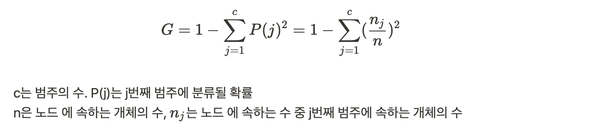
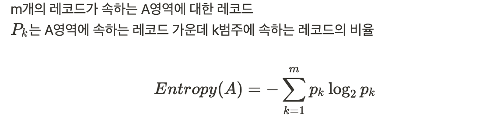
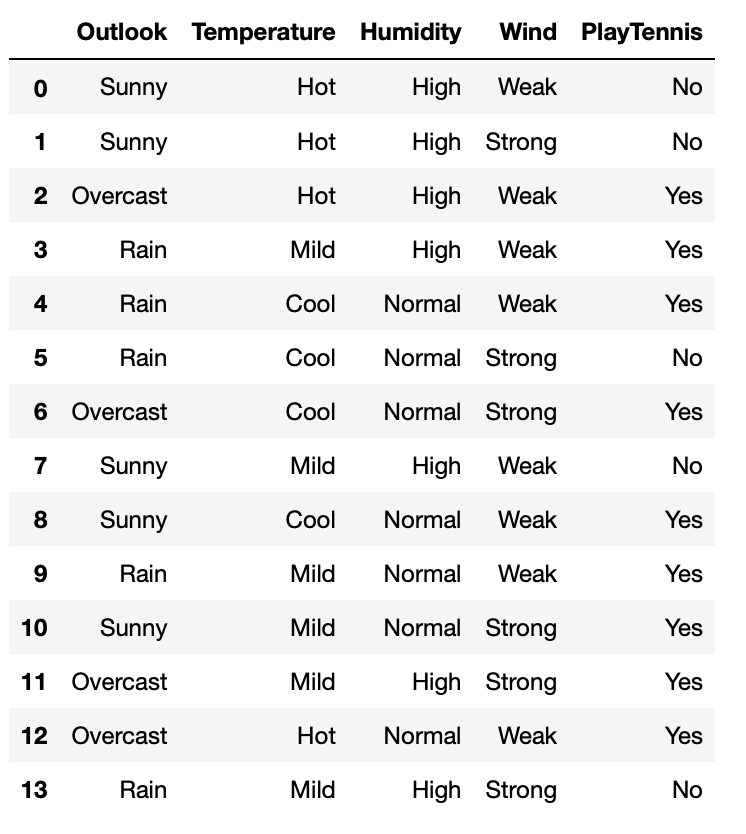
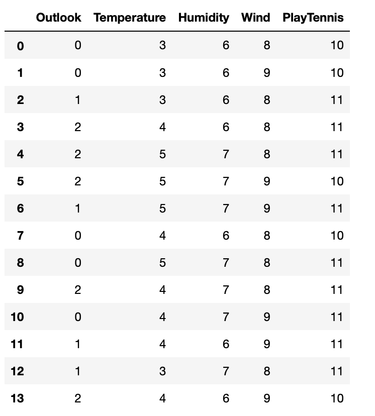
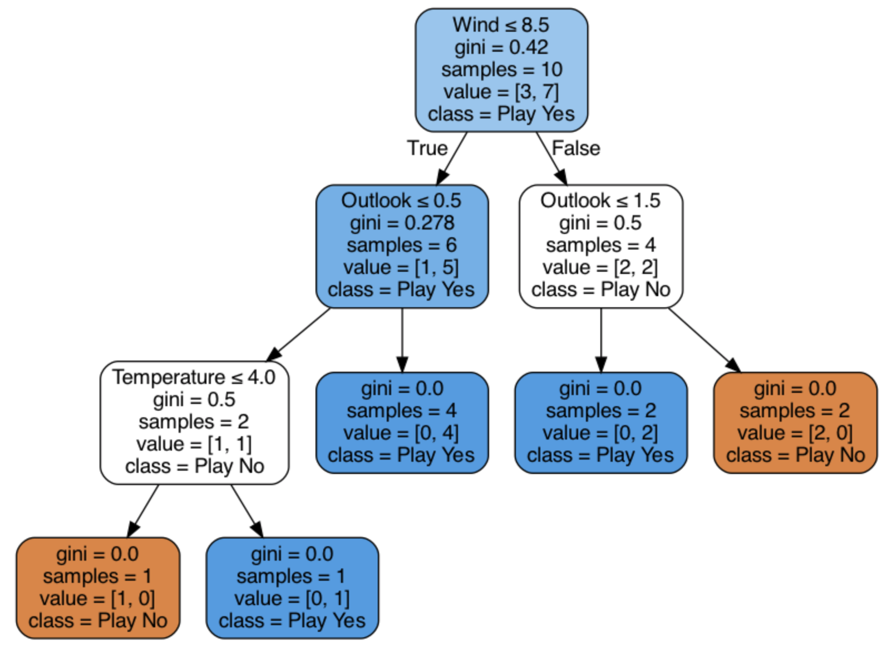

### 의사결정 트리란?

- 지도학습의 알고리즘
- 분류 또는 회귀분석 목적으로 사용
- 목표 변수 유형에 따른 의사결정 트리
    - 범주형 목표변수 : 분류트리
    ⇒ 목표변수가 이산형인 경우, 빈도에 따라 분리된 분류 트리 구성
    - 연속형 목표변수 : 회귀트리
    ⇒ 목표변수가 연속형인 경우, 평균과 표준편차에 기초해 분리, 회귀트리 구성

### 결정 트리 분석과정

1. 성장 : 분석 목적에 따라 각 노드에서 적절한 최적의 분리기준을 찾아 트리를 성장시키는 과정, 적절한 정지규칙을 통한 의사결정 트리 도출
2. 가지치기 : 오분류를 크게 할 위험이 높거나 부적절한 추론규칙을 가지는 불필요한 가지를 제거
3. 타당성 평가 : 이익도표, 위험도표 또는 검증용 자료로 의사결정 트리 평가
4. 해석 및 예측 : 의사결정트리를 해석하고 예측 모형 결정

### 의사결정 트리 분리 기준

- 부모 노드로부터 자식 노드들이 형성될 때, 생성된 자식 노드에 속하는 자료의 순수도가 가장 크게 증가하도록 트리를 형성하며 진행
- 입력 변수를 이용해 목표 변수의 분포를 얼마나 잘 구별하는 정도를 파악해 자식 노드가 형성되는데, 목표 변수의 구별 정도를 불순도에 의해 측정
- 불순도 : 다양한 범주들의 개체들이 포함되어 있는 정도
- 지니 지수
    - 데이터 집합의 불순도를 측정
    - 지니 지수가 0이면 데이터 집합에 속한 개체들이 같은 범주로 구성되어 있음. 작을 수록 잘 구분 된 것

    

- 엔트로피 지수
    - 주어진 데이터 집합의 혼잡도를 의미
    - 주어진 데이터 집합에 서로 다른 범주의 개체들이 많이 섞여 있으면 엔트로피가 높음
    
- 정보 이득
    - 상위 노드의 엔트로피 지수에서 하위 노드의 가중 평균한 엔트로피 지수를 뺀 것
    - 값이 클수록 선택한 하위 노드의 속성이 분류하기 좋다고 볼 수 있음

---

### 실습

#### 패키지 로드


```python
from sklearn.metrics import classification_report, confusion_matrix
from sklearn.model_selection import train_test_split
from sklearn.tree import DecisionTreeClassifier
from sklearn import tree

from IPython.display import Image

import pandas as pd
import numpy as np
import pydotplus
import os
```

#### 데이터


```python
tennis_data = pd.read_csv('playtennis.csv')
tennis_data
```



#### 데이터 전처리
각각의 string값들을 number로 대치

```python
tennis_data.Outlook = tennis_data.Outlook.replace('Sunny',0)
tennis_data.Outlook = tennis_data.Outlook.replace('Overcast',1)
tennis_data.Outlook = tennis_data.Outlook.replace('Rain',2)

tennis_data.Temperature = tennis_data.Temperature.replace('Hot',3)
tennis_data.Temperature = tennis_data.Temperature.replace('Mild',4)
tennis_data.Temperature = tennis_data.Temperature.replace('Cool',5)

tennis_data.Humidity = tennis_data.Humidity.replace('High',6)
tennis_data.Humidity = tennis_data.Humidity.replace('Normal',7)

tennis_data.Wind = tennis_data.Wind.replace('Weak',8)
tennis_data.Wind = tennis_data.Wind.replace('Strong',9)

tennis_data.PlayTennis = tennis_data.PlayTennis.replace('No',10)
tennis_data.PlayTennis = tennis_data.PlayTennis.replace('Yes',11)

tennis_data
```


#### 속성과 클래스 분리


```python
X = np.array(pd.DataFrame(tennis_data, columns = ['Outlook','Temperature','Humidity','Wind']))
y = np.array(pd.DataFrame(tennis_data, columns = ['PlayTennis']))
```

#### 테스트 셋과 트레인 셋 분리


```python
X_train,X_test,y_train,y_test = train_test_split(X,y)
```

#### 데이터 학습


```python
dt_clf = DecisionTreeClassifier()
dt_clf = dt_clf.fit(X_train,y_train)
```

#### 예측


```python
dt_prediction = dt_clf.predict(X_test)
```

#### 성능평가


```python
print(confusion_matrix(y_test,dt_prediction))
```

    [[1 1]
     [0 2]]


```python
print(classification_report(y_test,dt_prediction))
```

                  precision    recall  f1-score   support
    
              10       1.00      0.50      0.67         2
              11       0.67      1.00      0.80         2
    
        accuracy                           0.75         4
       macro avg       0.83      0.75      0.73         4
    weighted avg       0.83      0.75      0.73         4
    


#### 결정트리 시각화


```python
feature_names=tennis_data.columns.tolist()
feature_names=feature_names[0:4]

target_name=np.array(['Play No','Play Yes'])

# .dot 파일로 export 해줍니다
dt_dot_data = tree.export_graphviz(dt_clf,out_file=None,
                                   feature_names=feature_names,
                                   class_names=target_name,
                                   filled=True,rounded=True,
                                   special_characters=True
                                  )

dt_graph = pydotplus.graph_from_dot_data(dt_dot_data)
```


```python
Image(dt_graph.create_png())
```



