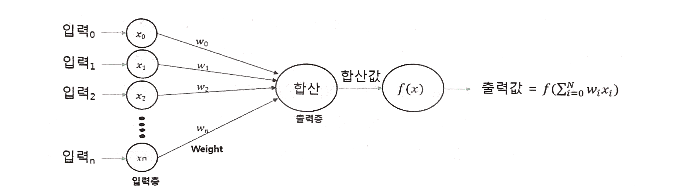
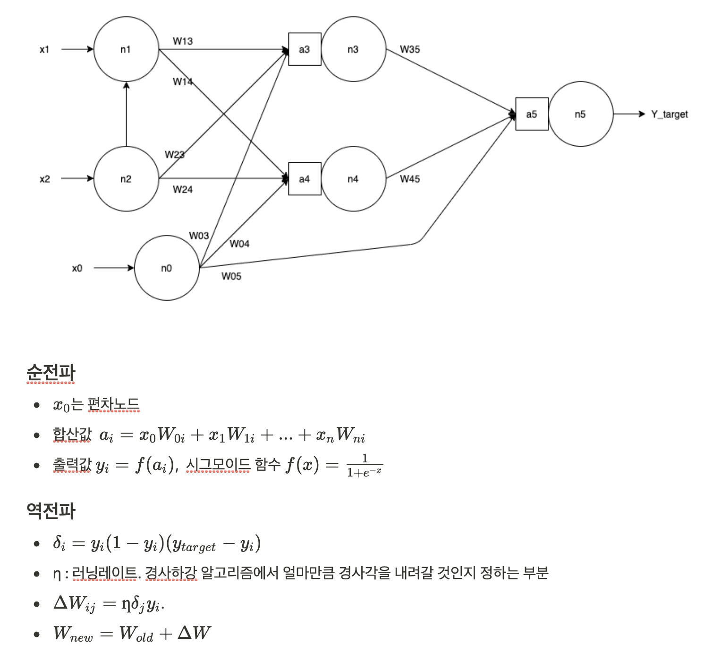

### 인공신경망 개념

#### 신경망과 뉴런



- 인공신경망이란 뉴런 구조를 모방해 만든 알고리즘
- n개의 노드로 구성된 입력층에서 데이터를 받아서 각 노드에 대한 가중치를 곱한 후 합산하여 활성화 함수에 넘겨 연산결과를 출력한다.


- 입력층과 출력층으로 구성, 다층신경망은 은닉층이 추가

#### 활성화함수

- 출력값을 내보낼 때 사용하는 함수
- 선형,계단,임계논리,시그모이드 함수등이 있음

### 단일계층신경망

- 입력층과 출력층만으로 구성
- XOR연산 불가

- **편차노드** : 전체 값을 계산할 때 오차를 줄이는 역할
- 적절한 편차노드와 활성화함수를 이용하면 and,or,not 연산 가능


### 다층신경망

- 입력층에서 데이터를 받아서 은닉층으로 재분배
- 은닉층에서 데이터의 특성을 파악, 은닉층 추가될때마다 계산량은 지수적으로 증가
- 출력층에서 은닉층의 신호를 받아 전체 신경망의 출력패턴을 정함

#### 역전파 알고리즘

- 오차값을 조절해 오차가 최소가 되게 하는 방법
- 역방향으로 가중치 오차를 전파해서 최적의 학습결과를 찾아가도록 함



---

### 실습

#### 데이터 로드


```python
from sklearn.datasets import load_iris

iris = load_iris()
```

#### 데이터셋 분리


```python
X = iris['data']
y = iris['target']

from sklearn.model_selection import train_test_split
X_train, X_test, y_train, y_test = train_test_split(X,y)
```

#### StandardScaler 라이브러리 로드
데이터의 범위를 평균 0, 표준편차 1의 범위로 바꿔주는 모듈. 정규화


```python
from sklearn.preprocessing import StandardScaler
scaler = StandardScaler()
```

#### 정규화


```python
# fit함수를 통해 X_train의 평균과 표준편차 계산
scaler.fit(X_train)

# transform을 통해 정규화
X_train = scaler.transform(X_train)
X_test = scaler.transform(X_test)
```

#### MLP 알고리즘 로드 및 HiddenLayer 할당


```python
from sklearn.neural_network import MLPClassifier

# 3개의 은닉층, 각 계층에 10개의 노드
mlp = MLPClassifier(hidden_layer_sizes=(10,10,10))
```

##### MLPClassifier 파라미터
- **activation** : 다층 신경망에서 사용하는 활성화 함수 (eg. 'relu')
- **alpha** : 신경망 내의 정규화 파라미터 
- **batch_size** : 최적화 시키기 위한 학습 최소 크기
- **epsilon** : 수치 안정성을 위한 오차 값
- **hidden_layer_size** : 히든레이어 크기
- **learning_rate** : 단계별로 움직이는 학습 속도
- **shuffle** : 데이터를 학습 시 데이터들의 위치를 임의적으로 변경하는 지의 여부
- **solver** : 가중치 최적화를 위해 사용하는 함수 (eg. 'adam')

#### 데이터 학습


```python
mlp.fit(X_train,y_train)

predictions = mlp.predict(X_test)
```

#### 성능평가


```python
from sklearn.metrics import classification_report, confusion_matrix

print(confusion_matrix(y_test,predictions))
```

    [[13  0  0]
     [ 0 11  0]
     [ 0  1 13]]


0행0열 값이 setosa를 정확하게 분류한 개수

1행1열 값이 versicolor를 정확하게 분류한 개수

2행2열 값이 virginica를 정확하게 분류한 개수


```python
print(classification_report(y_test,predictions))
```

                  precision    recall  f1-score   support
    
               0       1.00      1.00      1.00        13
               1       0.92      1.00      0.96        11
               2       1.00      0.93      0.96        14
    
        accuracy                           0.97        38
       macro avg       0.97      0.98      0.97        38
    weighted avg       0.98      0.97      0.97        38
    
