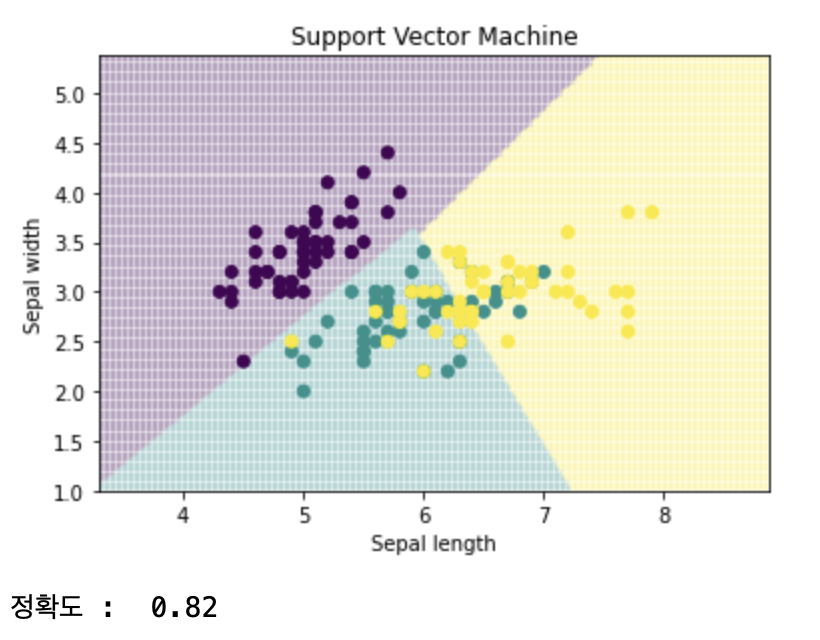
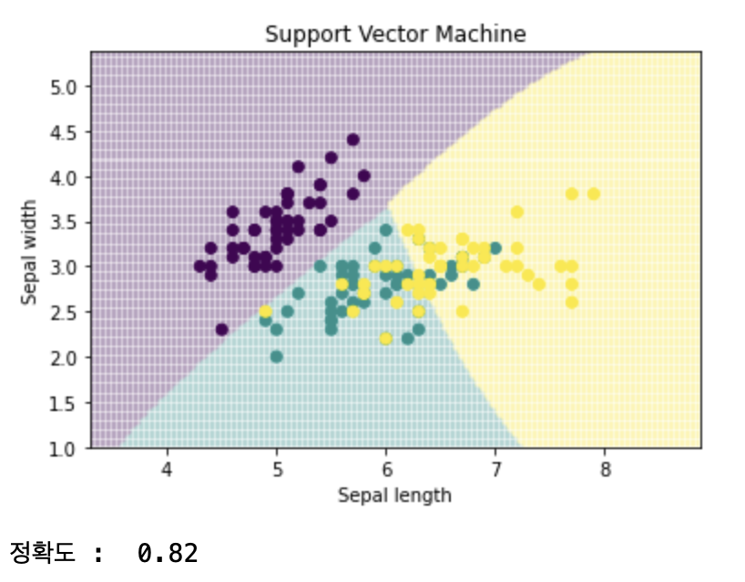
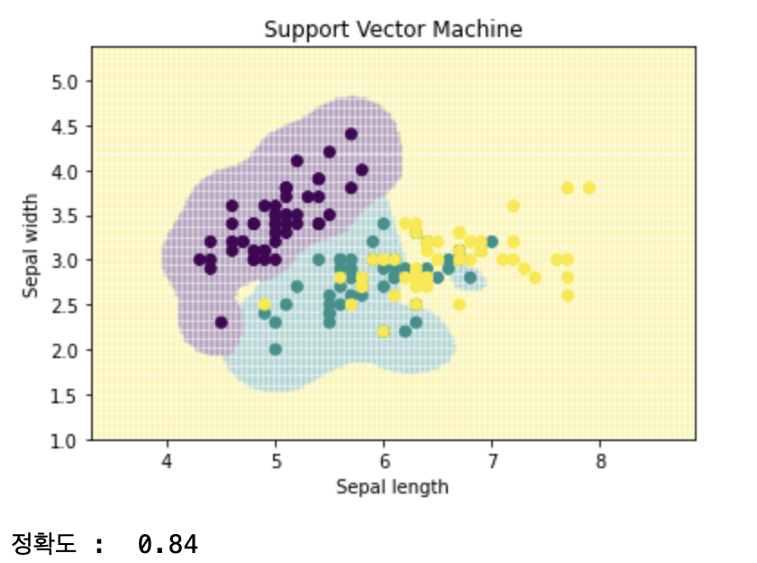
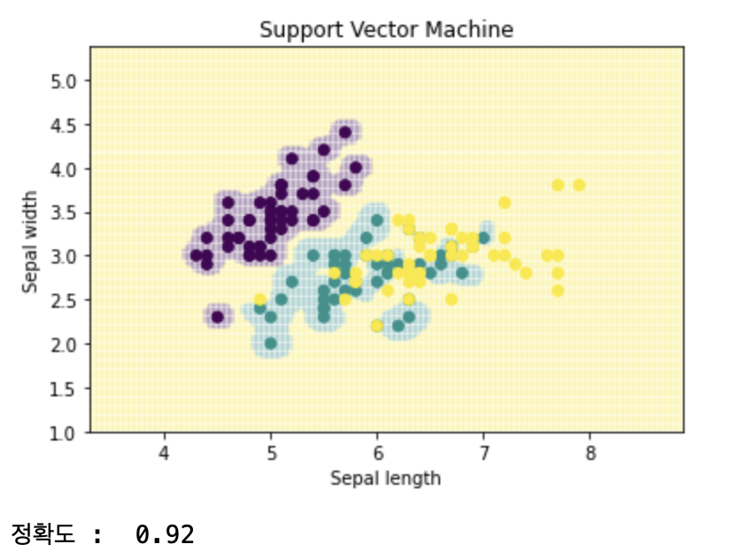
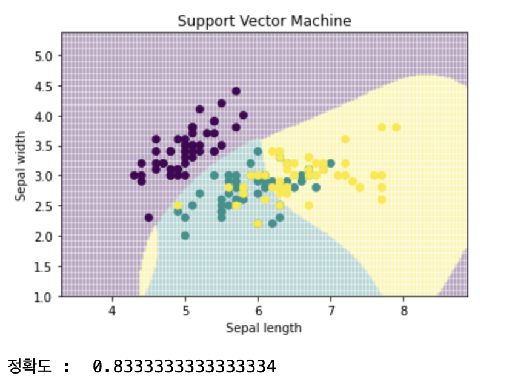
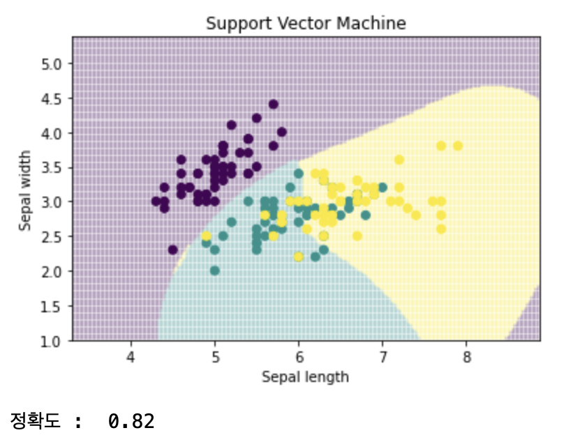

- SVM은 분류, 회귀에 사용할 수 있는 기계학습 알고리즘.<br/>
n차원 공간에 있는 각 데이터를, 가장 잘 구분하는 초평면, 경계선 또는 면을 찾는 것

- SVM은 Margin (초평면에서 가장 가까이에 있는 점과 초평면사이의 거리)을 최대화하는 것을 우선으로 해서 분류<br/>
SVM은 선형분류와 비선형분류에 사용

- 비선형 분류를 하기 위해서는 주어진 데이터를 고차원 특징 공간으로 사상하는 작업이 필요하다.<br/>
이 작업을 효율적으로 실행하기 위해 커널을 이용


- 주요 커널은 Linear Kernel, Polynomial Kernel, Radial Basis Function<br/>
분류를 잘하기 위해서 적절한 커널을 선택해야 하며 커널의 파라미터를 적절히 조절하여 오버피팅을 막아야 함

### 소프트 마진 선형 SVM 분류

Hard Margin 분류는 완벽하게 분류하지만 몇 개의 노이즈로 인해 초평면을 잘못 구할 수도 있음

이에 대한 보완으로 Soft margin. 서포트 벡터가 위치한 경계선에 여유 변수를 두어 노이즈들을 무시하고 초평면을 그림

- Primal 공식
- Dual 공식

### 많이 사용하는 커널

- Linear Kernel
- Gaussian Kernel
- Exponential Kernel
- Polynomial Kernel
- Hybrid Kernel
- Sigmoidal

---

### 실습

#### sklearn SVM 파라미터
- kernel
    - 기본값은 rbf. 커널 파라미터 값에는 rbf, linear, polynomial이 있음
- C
    - 기본값은 1.0
    - C값을 낮추면 초평면이 매끄러워지고, 높이면 서포트벡터들을 더 잘 분류함
- Gamma
    - 기본값은 auto
    - Gamma값을 낮추면 초평면에서 멀리 떨어진 서포트 벡터들의 영향이 낮고, 값을 높이면 멀리 떨어진 요소들의 값이 영향이 큼
    - 값을 높일 수록 초평면이 울퉁불퉁해짐

#### 패키지, 데이터 로드


```python
import numpy as np
import pandas as pd
import matplotlib.pyplot as plt
from sklearn import svm, datasets
%matplotlib inline

iris = datasets.load_iris()
```

#### 데이터 학습


```python
x = iris.data[:, :2]
y = iris.target
SVM = svm.SVC(kernel='linear',C=1).fit(x,y)
```

#### 데이터 시각화 전처리


```python
x_min, x_max = x[:, 0].min()-1, x[:, 0].max()+1
y_min, y_max = x[:, 1].min()-1, x[:, 1].max()+1
plot_unit = 0.025
xx, yy = np.meshgrid(np.arange(x_min,x_max,plot_unit), np.arange(y_min,y_max,plot_unit))
```

#### 데이터 시각화 및 성능 측정


```python
z = SVM.predict(np.c_[xx.ravel(), yy.ravel()])
z = z.reshape(xx.shape)
plt.pcolormesh(xx,yy,z,alpha=0.1)
plt.scatter(x[:,0],x[:,1],c=y)
plt.xlabel('Sepal length')
plt.ylabel('Sepal width')
plt.xlim(xx.min(),xx.max())
plt.title('Support Vector Machine')
plt.show()
print('정확도 : ',SVM.score(X=x,y=y))
```





#### 비선형
#### gamma 변화
##### kernel=rbf, C=1, gamma=auto


```python
SVM = svm.SVC(kernel='rbf',C=1).fit(x,y)
z = SVM.predict(np.c_[xx.ravel(), yy.ravel()])
z = z.reshape(xx.shape)
plt.pcolormesh(xx,yy,z,alpha=0.1)
plt.scatter(x[:,0],x[:,1],c=y)
plt.xlabel('Sepal length')
plt.ylabel('Sepal width')
plt.xlim(xx.min(),xx.max())
plt.title('Support Vector Machine')
plt.show()
print('정확도 : ',SVM.score(X=x,y=y))
```




##### kernel=rbf, C=1, gamma=10




##### kernel=rbf, C=1, gamma=100
overfitting


#### C 변화
##### kernel=rbf,C=100,gamma=auto
초평면이 더 작아지면서 마진이 작아짐



##### kernel=rbf,C=1000,gamma=auto
c=100과 유사하지만 정확도가 떨어짐




