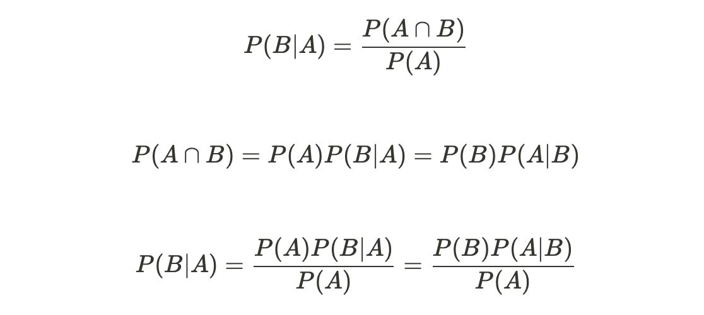

분류를 목적으로 하는 지도학습의 일종

### 베이즈 정리

- 두 확률 변수의 사전확률과 사후 확률 사이의 관계를 나타내는 정리
    - 사전 확률 정보를 이용해 사후 확률을 추정
    - **사전확률** : 가지고 있는 정보를 기초로 정한 초기 확률.
        - A : 사건의 원인, B : 결과, P(A) : 원인의 사전확률, P(B) : 결과의 사전확률
    - **사후확률** : 결과가 발생했다는 조건에서 어떤 원인이 발생했을 확률. P(A|B)
    - **우도** : 원인이 발생했다는 조건에서 결과가 발생했을 확률. P(B|A)


                         

### 라플라스 스무딩

- 나이브 베이즈 분류기에서 학습되지 않은 새로운 입력 벡터가 입력될 경우 조건부 확률이 0이 되는 문제 발생
- 이 문제를 해결하기 위해 확률값을 보정하는데 사용하는 기법

### 로그 변환

- 입력 벡터의 구성요소가 많아질수록 조건부확률이 너무 작아져서 비교가 불가능한 Underflow 현상 발생
- 이를 예방하기 위해 조건부확률 계산식에 log를 적용


---

### 실습

#### 패키지 로드


```python
from sklearn.model_selection import train_test_split
from sklearn.naive_bayes import GaussianNB
import pandas as pd
import numpy as np
```

#### 데이터 로드


```python
tennis_data = pd.read_csv('./playtennis.csv')
tennis_data
```
[ch4 의사결정트리](/파이썬을-이용한-빅데이터-분석-ch-4-의사결정트리)와 동일한 데이터

#### 데이터 분리


```python
X = np.array(pd.DataFrame(tennis_data,columns=['Outlook','Temperature','Humidity','Wind']))
y = np.array(pd.DataFrame(tennis_data,columns=['PlayTennis']))
```


```python
X_train,X_test,y_train,y_test = train_test_split(X,y)
```

#### 나이브 베이즈 모델 생성


```python
gnb_clf = GaussianNB()
gnb_clf = gnb_clf.fit(X_train,y_train.ravel())
```

#### 클래스 예측


```python
gnb_prediction = gnb_clf.predict(X_test)
```


```python
print('X_test\n',X_test)
print('y_test\n',gnb_prediction)
```

    X_test
     [[2 5 7 9]
     [0 4 7 9]
     [1 4 6 9]
     [1 5 7 9]]
    y_test
     [11 10 10 11]


#### 분류성능측정


```python
from sklearn.metrics import confusion_matrix
from sklearn.metrics import classification_report
from sklearn.metrics import f1_score
from sklearn.metrics import accuracy_score
```


```python
print('Confusion Matrix')
print(confusion_matrix(y_test,gnb_prediction))
```

    Confusion Matrix
    [[0 1]
     [2 1]]


```python
print('Classification Report')
print(classification_report(y_test,gnb_prediction))
```

    Classification Report
                  precision    recall  f1-score   support
    
              10       0.00      0.00      0.00         1
              11       0.50      0.33      0.40         3
    
        accuracy                           0.25         4
       macro avg       0.25      0.17      0.20         4
    weighted avg       0.38      0.25      0.30         4
    


```python
fmeasure = round(f1_score(y_test,gnb_prediction,average='weighted'),2)
accuracy = round(accuracy_score(y_test,gnb_prediction,normalize=True),2)
```
