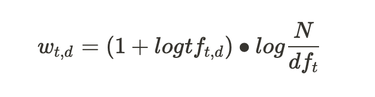

### 텍스트 정규화
#### 토큰화

텍스트를 의미 단위로 분할하는 작업. 여기서 토큰(Token)과 어간(Type)는 약간 다름. 

Token은 공백기준으로 단순분할, Type은 중복을 제외하고 어간이 같은 단어의 중복을 제외

토큰화 작업은 언어마다 방법이 다름

- 영어 : 단순 공백 기준 분할
- 독일어 : 복합 명사에 대한 분리 방법이 요구됨
- 중국어 : 공백이 없으며 여러 문자로 한 단어가 이뤄짐.
- 한국어 : 품사 기준으로 토큰화

#### 어간추출

**표제어 추출(Lemmatization)**

- 단어의 기본형인 표제어를 찾는 작업. 문장 구조상 단어의 의미를 파악

**어간 추출(Stemming)**

- 형태가 변형된 단어에 대해 접사 등을 제거하고 어간을 분리해 내는 작업

**포터 알고리즘**

- 대표적인 영어 어근 추출 알고리즘

#### 형태소 분석
토큰화된 단어의 품사 정보 추출

- POS-Tagging (Part Of Speech - Tagging)  토큰의 품사정보를 추출
    - Open class :
    새로운 단어의 등장이 많은 품사들. 
    명사,동사,형용사,부사
    - Closed class :
    상대적으로 새로운 단어 추가가 적은 셋, 주로 문법적 역할
    전치사, 조동사, 대명사
- 영어 형태소 분석기
    - Stanford POS-Tagger
    - NLTK POS-Tagger
- 한글 형태소 분석기
    - Hannanum
    - Kkma
    - Komoran
    - Twitter

---

### 텍스트 분석
#### 정보 추출 (Information Retrieval, IR)

구조화 되지 않은 문서 군집 내에서 필요한 정보를 포함하고 있는 문서를 찾아내는 작업

1. 문서 단어 행렬  단어를 벡터로 표현하여 연산이 가능
    - 각 단어가 각 문서에 등장하는지 유무를 표현하는 행렬 
    ⇒ 단어가 많아지면 대부분의 값이 0인 행렬이 되는 문제
    - 각 단어가 각 문서에 몇번 등장하는지 빈도를 표현하는 행렬
2. Bag of Words 모델
문서 내에 등장하는 단어들의 순서를 무시
3. Term Frequency (TF)
    - 특정 단어가 특정 문서에 등장하는 빈도
    - 문서의 관련도, 타당성은 TF와 비례하게 증가하지 않음
    - TF값 이 클 수록 문서에 많이 등장하지만, 정보가 부족한 단어일 수 있음
    (e.g. good, high, increase ... )
    - 드물게 등장하는 단어가 더 중요한 정보를 가질 수 있기 때문에 가중치를 부여할 필요가 있음
4. Inverse Document Frequency (IDF)
    - df : 특정 단어가 등장한 문서의 수..작을 수록 그 문서에서 중요한 역할을 할 가능성이 높음
    - df의 역수는 특정 단어의 중요도..
    

5. TF - IDF
    - TF와 IDF의 곱. 문서군 내에서 특정 단어의 중요도를 수치화한 값

6. 문서 벡터화를 질의에 적용
    - 문서들을 tf-idf값으로 이뤄진 벡터로 변형하면 문서들을 유사도에 따라 정렬할 수 있음
    - 방향이 같은 벡터를 가진 문서들에는 적용이 어려움
    - 위 문제 극복을 위해 정규화 벡터의 Cosine 유사도를 사용

#### 문서 분류

- 문서를 특정 클래스(카테고리, 주제, 장르 등)로 분류하는 작업
- e.g. 스팸 필터링, 저자 확인..
- 문서와 클래스를 입력하면 문서가 속하는 클래스를 출력

- 규칙 기반 문서 분류
    - 규칙을 유지 관리하는 비용이 큼

- 나이브베이즈를 사용한 문서분류

- Laplace Smoothing
    - 학습 문서에 없는 새로운 단어가 등장할 경우, 확률이 0이 되는 문제 발생
    - 새로운 단어 등장 시 해당 빈도에 1을 더해줌으로써 처리

#### 감성 분석

- 텍스트로부터 태도, 의견, 성향 등의 정보를 추출하는 방법
- 기본적으로 긍정, 중립, 부정 파악. 세분화해 감정 분석 가능
- 감성분석을 통해 시장 움직임, 투표결과 등 예측 가능
- 감정을 나타내는 형용사를 추출하여 분석

