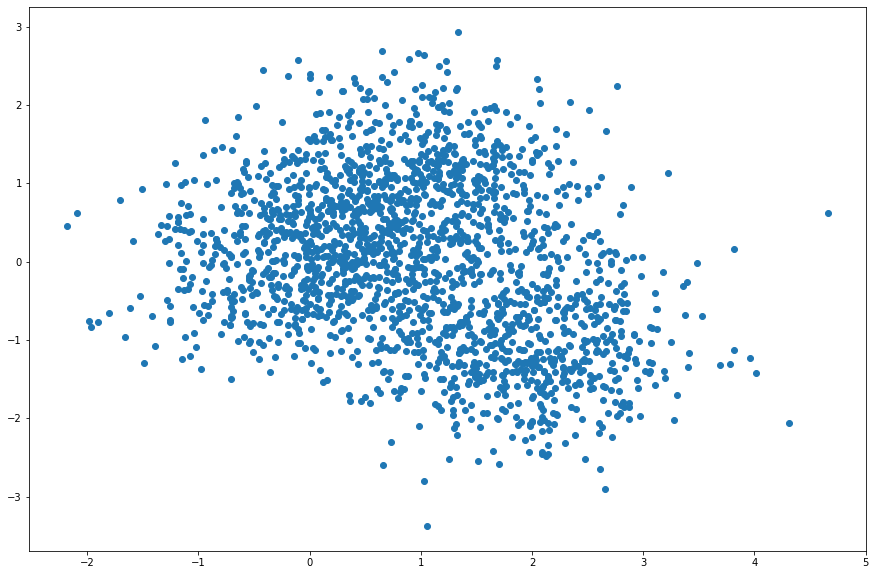
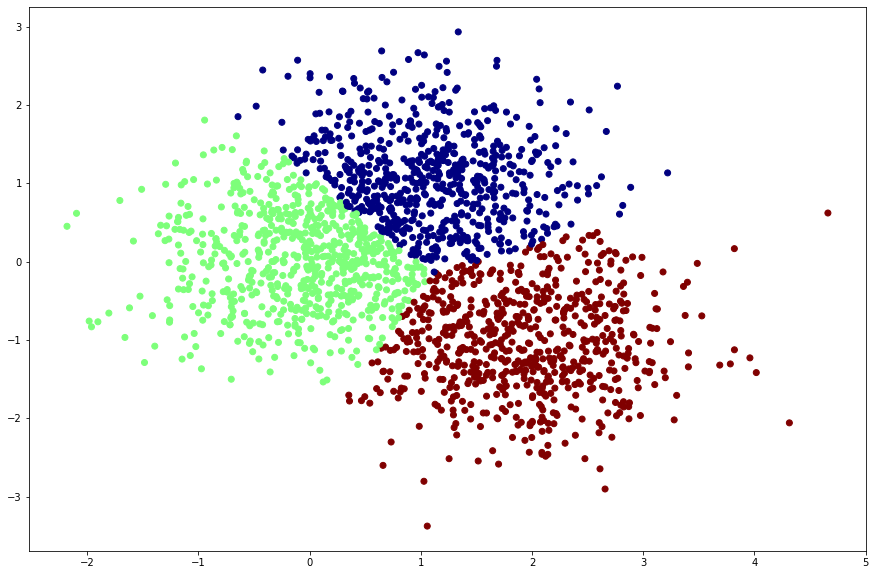

### K-means

- 비지도 학습, 클러스터링의 대표적인 알고리즘
- 주어진 데이터를 k개의 클러스터로 묶는 알고리즘, 데이터들과 각 클러스터와의 거리 차이의 분산을 최소화
- 클러스터를 나누는 기준은 데이터들 간의 유사도. 데이터 간의 거리가 가까울 수록 유사도가 크다. 데이터간의 거리는 유클리드 거리 측정법

#### K-means 알고리즘 원리

##### 클러스터 내 응집도 최소화


##### 클러스터 간 분리도 최소화


#### K-means 알고리즘 수행단계

1. 전체 클러스터 개수 K값을 설정
2. K개의 그룹으로 군집한 n개의 점을 가지고 있고, 여기서 임의로 K개의 점을 선택하여 K개의 클러스터의 초기 중심점을 정함
3. 각 클러스터의 중심점과 개별 데이터간의 거리를 측정하여 클러스터를 할당
4. 각 클러스터 마다 그 안에 배정된 모든 점을 간의 거리 평균값을 구하여 새로운 중심점을 정함
5. 3~5의 과정을 반복

---

### K-means 실습
#### 패키지 가져오기, matplotlib 설정


```python
from sklearn.cluster import KMeans
from sklearn.datasets import make_blobs

import numpy as np
import matplotlib.pyplot as plt

%matplotlib inline
```

#### 클러스터링 샘플 데이터 생성


```python
# 시드값 설정
np.random.seed(0)

centers = [[1,1],[0,0],[2,-1]] # 초기 중심점
n_clusters = len(centers)

# 데이터 생성
data, labels_true = make_blobs(n_samples = 2000, centers=centers, cluster_std = 0.7)
```


```python
print(data)
print(labels_true)
```

    [[ 2.88735684  0.94825273]
     [ 0.00712986  1.53880744]
     [ 0.3264657  -0.06607475]
     ...
     [ 0.53901292  0.64003622]
     [ 1.65065358  1.40755721]
     [ 0.74131908 -0.71579507]]
    [0 1 1 ... 0 0 1]


```python
plt.figure(figsize=(15,10))
plt.scatter(data[:,0],data[:,1])
```




#### 클러스터링 모델 생성 및 학습


```python
estimator = KMeans(init = 'k-means++',n_clusters=3, n_init=10)
estimator.fit(data)
```


    KMeans(n_clusters=3)


#### 학습한 모델로 예측한 라벨 데이터


```python
labels_predict = estimator.labels_
labels_predict
```


    array([0, 0, 1, ..., 0, 0, 1], dtype=int32)


#### 데이터 정규화
라벨 값 0,1,2를 정규화


```python
cm = plt.cm.get_cmap('jet')
scaled_labels = (labels_predict - np.min(labels_predict))
scaled_labels = scaled_labels/(np.max(labels_predict) - np.min(labels_predict))
np.unique(scaled_labels)
```


    array([0. , 0.5, 1. ])


#### 클러스터링 결과


```python
plt.figure(figsize=(15,10))
plt.scatter(data[:,0], data[:,1], c= cm(scaled_labels))
```


    <matplotlib.collections.PathCollection at 0x119bfc850>




