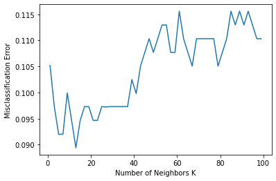

### KNN

- 지도학습, 분류 알고리즘
- 주어진 데이터로부터 거리가 가까운 k개의 다른 데이터들의 라벨 중 가장 많은 비율을 차지하는 라벨을 참조하여 분류하는 알고리즘
- 사례 기반 알고리즘의 한 종류로 데이터 양이 많아지면 속도가 느려질 수 있음

#### K 개수 최적화 문제

- k값이 클 때 전체적인 노이즈를 줄일 수 있지만 중요한 패턴을 무시할 가능성
- 최적의 K값을 찾기 위해 K-fold Cross-validation 방법을 활용
- k=1일 때 **over-fitting** 될 수 있음
- k값이 너무 클 때 새로운 데이터의 라벨은 항상 전체 데이터의 대다수를 차지하는 라벨로 분류하는 **under fitting** 문제 발생

---
### KNN 실습

#### 패키지 , 데이터 로드


```python
from sklearn.neighbors import KNeighborsClassifier
from sklearn.metrics import accuracy_score
from sklearn.model_selection import train_test_split
from sklearn.model_selection import cross_val_score

import pandas as pd
import numpy as np

from sklearn.datasets import load_breast_cancer
from sklearn.preprocessing import normalize
```


```python
breast_cancer = load_breast_cancer()
X = breast_cancer.data
y = breast_cancer.target

df = pd.DataFrame(X,columns = breast_cancer.feature_names)
```


#### 데이터 셋 분리


```python
X_train, X_test, y_train, y_test = train_test_split(X,y,test_size=0.33, random_state = 42)
```

#### 모델 학습 및 정확도 측정


```python
estimator = KNeighborsClassifier(n_neighbors=5, weights = 'distance')

estimator.fit(X_train,y_train)

label_predict = estimator.predict(X_test)

print("The accuracy score of classification: %.9f"%accuracy_score(y_test,label_predict))
```

    The accuracy score of classification: 0.941489362


#### Cross Validation방법을 사용하여 최적의 k값을 찾기


```python
myList = list(range(1,100))
neighbors = [ x for x in myList if x%2!=0]
print("k의 후보값들 추출",neighbors)
cv_scores = []
```

    k의 후보값들 추출 [1, 3, 5, 7, 9, 11, 13, 15, 17, 19, 21, 23, 25, 27, 29, 31, 33, 35, 37, 39, 41, 43, 45, 47, 49, 51, 53, 55, 57, 59, 61, 63, 65, 67, 69, 71, 73, 75, 77, 79, 81, 83, 85, 87, 89, 91, 93, 95, 97, 99]


```python
for k in neighbors:
    print("< k = %d >"%k)
    estimator = KNeighborsClassifier(n_neighbors=k)
    scores = cross_val_score(estimator, X_train, y_train, cv=10,scoring="accuracy")
    print("The scores of classification are \n"+str(scores))
    cv_scores.append(scores.mean())
    print("The average score of score is %.9f \n"%scores.mean())
```

    < k = 1 >
    The scores of classification are 
    [0.97435897 0.84210526 0.92105263 0.97368421 0.81578947 0.89473684
     0.89473684 0.89473684 0.89473684 0.84210526]
    The average score of score is 0.894804318 
    
    < k = 3 >
    The scores of classification are 
    [0.94871795 0.86842105 0.89473684 0.94736842 0.94736842 0.89473684
     0.86842105 0.89473684 0.94736842 0.81578947]
    The average score of score is 0.902766532 
    
    < k = 5 >
    The scores of classification are 
    [0.94871795 0.86842105 0.89473684 0.94736842 0.94736842 0.92105263
     0.94736842 0.86842105 0.92105263 0.81578947]
    The average score of score is 0.908029690 

    ...


```python
MSE = [1 - x for x in cv_scores]

plt.plot(neighbors, MSE)
plt.xlabel("Number of Neighbors K")
plt.ylabel("Misclassification Error")
plt.show()

min_MSE = min(MSE)
index_of_min_MSE = MSE.index(min_MSE)
optimal_k = neighbors[index_of_min_MSE]
print("The optimal number of neighbors i is %d"%optimal_k)
```





    The optimal number of neighbors i is 13


```python
estimator = KNeighborsClassifier(n_neighbors =13)
estimator.fit(X_train,y_train)

label_predict = estimator.predict(X_test)

print("accuracy: %.9f"%accuracy_score(y_test, label_predict))
```

    accuracy: 0.962765957

